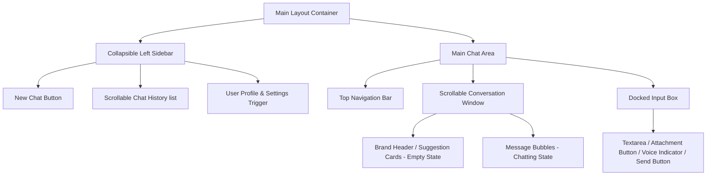

# Product Requirements Document (PRD): Professional AI Chatbot UI Upgrade
**Target Platform for Code Generation:** [v0.dev](https://v0.dev)  
**Project Context:** Next.js 16 (App Router), React 19, Tailwind CSS, Prisma, NextAuth

---

## 1. Project Overview & Objective
The objective is to completely transform the application's interface from its current cyberpunk styling ("ULTRON") into a highly polished, clean, and professional conversational AI interface inspired by **OpenAI ChatGPT** and **Google Gemini**. 

The generated UI must feel modern, premium, and distraction-free, focusing on readability, fluid animations, responsive layouts, and intuitive controls.

---

## 2. Design System & Aesthetics (Tailwind CSS)

### Curated Color Palette
- **Light Mode:**
  - Background: Pure White (`#ffffff`) or Soft Gray (`#f9fafb` / `bg-gray-50`)
  - Panels/Cards: White (`#ffffff` / `bg-white`)
  - Primary Text: Charcoal (`#111827` / `text-gray-900`)
  - Secondary Text: Slate Gray (`#4b5563` / `text-gray-600`)
  - Accent/Primary: Deep Slate/Indigo (`#4f46e5` / `bg-indigo-600` or `#0f172a` / `bg-slate-900`)
  - Borders: Thin Light Slate (`#e5e7eb` / `border-gray-200`)
- **Dark Mode (Default):**
  - Background: Deep Obsidian (`#0b0f19` / `bg-slate-950` or `#0d0d0d`)
  - Panels/Cards: Dark Gray Slate (`#161e2e` / `bg-slate-900` or `#1a1a1a`)
  - Primary Text: Off-white (`#f3f4f6` / `text-gray-100`)
  - Secondary Text: Muted Gray (`#9ca3af` / `text-gray-400`)
  - Accent/Primary: Electric Blue/Indigo (`#6366f1` / `text-indigo-400` or `#38bdf8` / `text-sky-400`)
  - Borders: Dark Muted Slate (`#1f2937` / `border-gray-800`)

### Typography
- **Primary Body & Interface:** Inter (`font-sans`)
- **Headers & Brand:** Outfit or Inter (`font-sans` with `font-semibold` / `font-bold`)
- **Code & Snippets:** Source Code Pro or JetBrains Mono (`font-mono`)

---

## 3. UI Component Breakdown & Layout



### 3.1. Main Layout
- A full-height, full-width container (`h-screen w-screen overflow-hidden flex bg-background text-foreground`).
- A smooth collapsible sidebar on the left and the main chat container on the right.

### 3.2. Left Sidebar (Collapsible & Responsive)
- **Top Section:**
    - "New Chat" button: Premium look, rounded (`rounded-lg border border-border bg-transparent hover:bg-slate-900 px-4 py-2 flex items-center justify-between text-sm transition-all`). Includes a Lucide `SquarePen` or `Plus` icon.
    - Collapse toggle button: Easily hides/shows the sidebar with a smooth slide transition.
- **Middle Section (Scrollable History):**
    - Grouped list of previous chats (e.g., "Today", "Yesterday", "Previous 7 Days").
    - Individual chat items showing truncated titles, active state styling, and a hover-to-reveal delete button (`Trash2` icon).
- **Bottom Section:**
    - User Profile Indicator: Shows user's avatar, name, and email.
    - Settings Trigger: Cog/Settings icon opening a settings modal.

### 3.3. Top Navigation Bar
- A thin, clean header (`h-14 border-b border-border flex items-center justify-between px-6 bg-background/50 backdrop-blur-md sticky top-0 z-30`).
- Left side: Hamburger menu (mobile only) to toggle the sidebar.
- Center: Model Selector dropdown (e.g., "ULTRON-1.0", "Gemini Pro", "GPT-4o") with a sleek chevron icon.
- Right side: Quick actions like toggling mode/theme (Light/Dark) or voice status indicators.

### 3.4. Scrollable Chat Window
- **Empty State (Welcome Screen):**
    - Large centered welcoming title: "How can I help you today?" with a subtle gradient effect.
    - Suggestion Cards: A grid of 2-4 cards with common prompts (e.g., "Help me write an essay", "Create a workout plan", "Analyze a dataset") that copy directly into the input field on click.
- **Message List (Chatting State):**
    - Streamlined layout: Messages occupy a wide max-width (`max-w-3xl mx-auto py-6 space-y-8 px-4`).
    - Assistant messages: Minimalist, no heavy background container. Subtle avatar or icon next to the text.
    - User messages: Encased in a soft, rounded light-gray or dark-slate bubble, aligned to the right or centered slightly to the right.
    - **Markdown Elements:** Beautiful typography for headers, bold text, lists, and inline code.
    - **Code Blocks:** Copyable code snippets with a header bar showing the language name (e.g., "typescript") and a "Copy Code" button.
    - **Thinking / Streaming State:** A pulsing, three-dot indicator or wave visualizer indicating active generation.

### 3.5. Docked Input Area
- Positioned at the bottom center, taking up `max-w-3xl mx-auto w-full pb-6 px-4`.
- **Textarea Container:** A floating glass container (`rounded-2xl border border-border bg-slate-900/60 backdrop-blur-lg focus-within:ring-2 focus-within:ring-indigo-500/50 transition-all p-2 flex flex-col gap-2`).
- **Input Field:** Auto-expanding `textarea` that handles Enter (submit) and Shift+Enter (new line) with a placeholder "Ask anything..." or "Message ULTRON...".
- **Action Buttons Bar:**
    - Attachment Button (Lucide `Paperclip` or `Plus` icon) to upload documents/images.
    - Voice Input Toggle (Lucide `Mic` icon) with a pulsing audio wave effect when recording.
    - Send Button (Lucide `ArrowUp` icon): Inactive/grayed-out when the input is empty, and lights up as a solid, vibrant circle button when text is typed.

---

## 4. Interaction Guidelines & Micro-Animations
- **Hover Transitions:** All buttons, history list items, and links must have a smooth hover color transition (`transition-all duration-200 ease-in-out`).
- **Sidebar Slide:** The collapsible sidebar should slide out of view smoothly using Tailwind transition properties (`transition-transform duration-300 transform`).
- **Message Appearance:** Incoming messages should fade in and slide up slightly (`animate-fade-in-up`).
- **Copy Confirmation:** Clicking "Copy Code" changes the button label to "Copied!" with a checkmark icon, reverting back after 2 seconds.

---

## 5. Hook Integration Guide (For Your Codebase)

When pasting the code generated by `v0.dev` into your project files, make sure to wire up the components to your existing custom React hooks and states:

### 1. Chat State (`app/components/ui/ChatInterface.tsx`)
Replace the static message rendering with the `useChat()` hook variables:
```tsx
import { useChat } from '@/app/components/providers/ChatProvider';

export default function ChatInterface() {
  const { messages, sendMessage, isStreaming } = useChat();
  
  // 1. Render message.sender === 'user' as User bubble
  // 2. Render message.sender === 'assistant' as Assistant bubble
  // 3. Trigger sendMessage(inputText) on form submission
  // 4. Show the loading/thinking state when isStreaming is true
}
```

### 2. Voice Input (`app/components/ui/ChatInterface.tsx`)
Hook up your microphone button to your custom voice activation hook:
```tsx
import { useVoice } from '@/app/components/hooks/useVoice';

export default function VoiceButton() {
  const { isRecording, toggleRecording, transcript } = useVoice();

  // 1. Add active class/pulse effect when isRecording is true
  // 2. Trigger toggleRecording on click
  // 3. Append transcript to input text state when transcript updates
}
```

### 3. Sidebar History (`app/components/ui/Sidebar.tsx`)
Populate your history using the Prisma schema context or active chat sessions:
```tsx
import { useSession } from 'next-auth/react';

export default function Sidebar() {
  const { data: session } = useSession();
  // Fetch and map previous user ChatSessions
}
```
